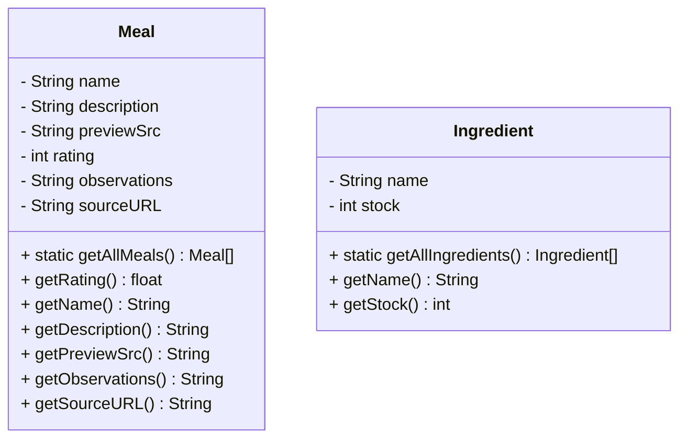

```mermaid
classDiagram

    class Meal{
        - String name
        - String description
        - String previewSrc
        - int rating
        - String observations
        - String sourceURL

        + static getAllMeals() Meal[]
        + getRating() float
        + getName() String
        + getDescription() String
        + getPreviewSrc() String
        + getObservations() String
        + getSourceURL() String
    }

    class Ingredient{
        - String name
        - int stock

        + static getAllIngredients() Ingredient[]
        + getName() String
        + getStock() int
    }
```