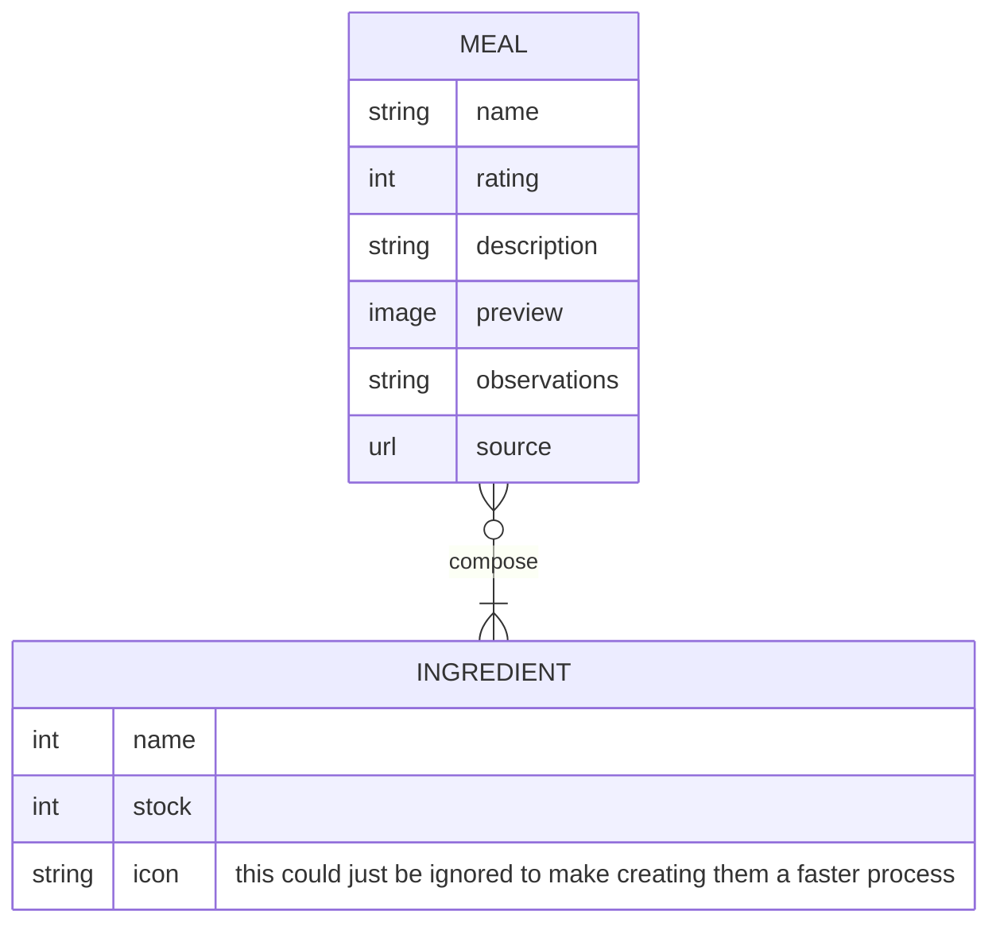

```mermaid
erDiagram
    MEAL 0+ to 1+ INGREDIENT:compose

    MEAL{
        string name
        int rating
        string description
        image preview
        string observations
        url source
    }

    INGREDIENT{
        int name
        int stock
        string icon "this could just be ignored to make creating them a faster process"
    }
```