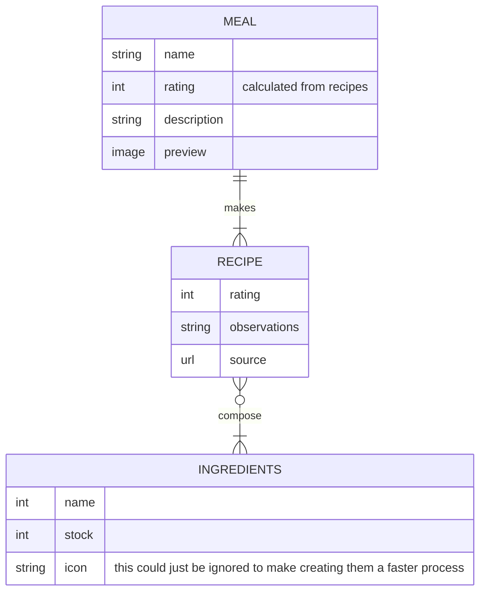

```mermaid
erDiagram
    MEAL 1 to 1+ RECIPE: makes
    RECIPE 0+ to 1+ INGREDIENTS:compose

    MEAL{
        string name
        int rating "calculated from recipes"
        string description
        image preview
    }

    RECIPE{
        int rating
        string observations
        url source
    }

    INGREDIENTS{
        int name
        int stock
        string icon "this could just be ignored to make creating them a faster process"
    }
```